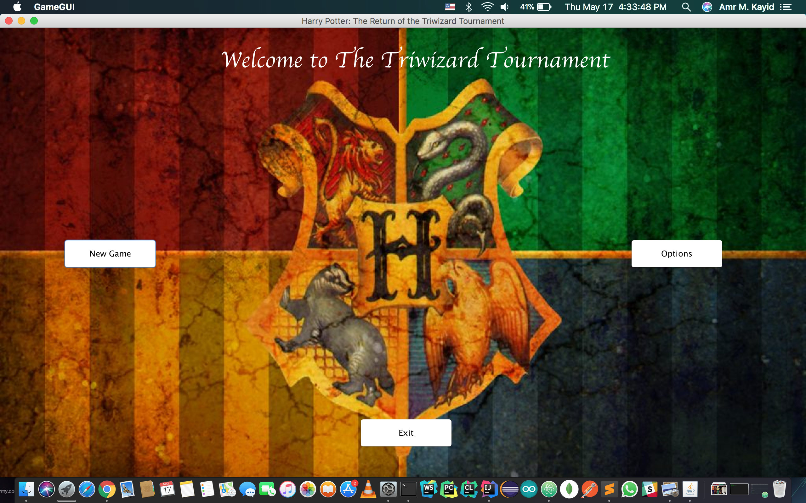
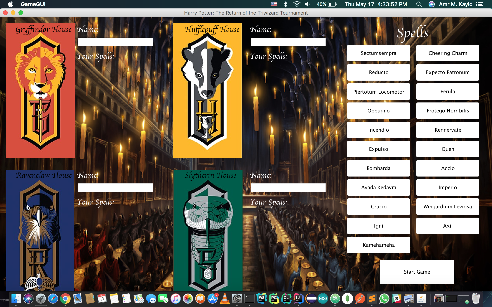

<h1 align="center"> Harry Potter: The Return of the Triwizard Tournament </h1>

# Game Overview:
##### The game is a role-playing game (RPG) featuring the Triwizard Tournament from the Harry Potter series. The game consists of different maps representing the three tasks of the tournament. The champions will compete against each other at the same time inside each map. The champions will take on the roles of Hogwarts students i.e. apprentice wizards.

### Screenshots
|                    Intro                         |                           Players                        |
| :-----------------------------------------------:| :------------------------------------------------------: | 
|  |     |

# MileStones:
- [x] Milestone 1: Game Hierarchy

- [x] Milestone 2: Engine: Tournament Tasks Implementation

- [x] Milestone 3: Exceptions + Setup for the GUI

- [ ] Milestone 4: GUI + Integration

The Game is developed in an Object-Oriented Design using Java, OOP features, Swing library for the GUI.
